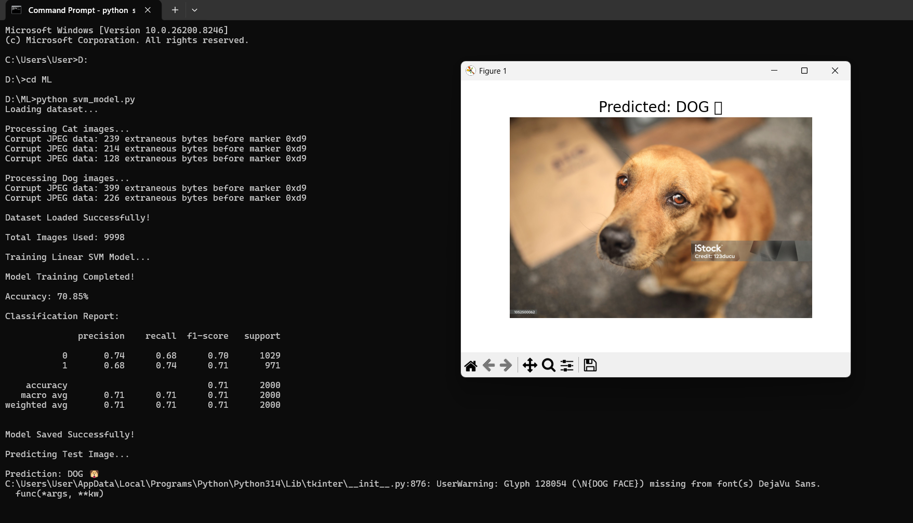

# PRODIGY_ML_03

## Cat vs Dog Image Classification using SVM

This project implements a Support Vector Machine (SVM) model to classify images of cats and dogs using HOG (Histogram of Oriented Gradients) feature extraction.

## 📌 Dataset
Microsoft Cats and Dogs Dataset:  
https://www.microsoft.com/en-us/download/details.aspx?id=54765

## 📌 Project Overview
- Image preprocessing using OpenCV
- Feature extraction using HOG
- Classification using Linear SVM
- Model evaluation using accuracy score and classification report
- Prediction on custom test images

## 🛠 Technologies Used
- Python
- OpenCV
- NumPy
- Scikit-learn
- Scikit-image
- Matplotlib
- Joblib

## 📂 Project Structure

```plaintext
PRODIGY_ML_03/
│
├── output.png
├── test.jpg
├── svm_model.py
└── README.md
```

## 🚀 How to Run

1. Install required libraries
```bash
pip install opencv-python numpy matplotlib scikit-learn scikit-image joblib
```

2. Run the Python file
```bash
python svm_model.py
```

## 📊 Output



The model predicts whether the input image is:
- CAT 🐱
- DOG 🐶

## 🎯 Learning Outcome
This project helped in understanding:
- Image preprocessing
- Feature extraction techniques
- Supervised Machine Learning
- SVM classification
- Computer Vision basics
